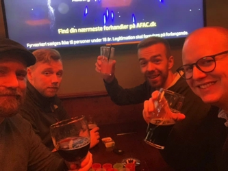

This repository is for the group DECK-CS.
It will be used for the group during 3. semester at CPH Business Academy.

### Week review:

Uge | Review dato | Link
------------ | ------------- | -------------
Uge 1| 04-02-2019 | [Link til gruppens review](https://kimhotdk.github.io/DECK-CS/week1) 
Uge 2| 11-02-2019 |  [Link til gruppens review](https://kimhotdk.github.io/DECK-CS/week2) 
Uge 3| 18-02-2019 |  [Link til gruppens review](https://kimhotdk.github.io/DECK-CS/week3) 
Uge 4| 25-02-2019 |  [Link til gruppens review](https://kimhotdk.github.io/DECK-CS/week4) 

### Members of DECK-CS:

Billede | Navn | GITHUB Link
------------ | ------------- | -------------
 |  **Dan Tomicic:** | [_GodLikeCPU_](https://github.com/GodLikeCPU)
 | **Esben Dalgaard:** | [_Edunno_](https://github.com/Edunno)
 | **Casper Marx:** | [_Marx02_](https://github.com/Marx02)
 | **Kim P. Pedersen:** | [_KimHotDK_](https://github.com/KimHotDK)

### Link to DECK-CS group agreement :
[Link til gruppens aftaledokument](https://docs.google.com/document/d/1uSLKk3kQAV3UQ0Y1XKtVFQ_YJ_gXrON00-IDqS8o5s4/edit?usp=sharing) 

### Picture of the group:
  
**DECK-CS ©2019**
